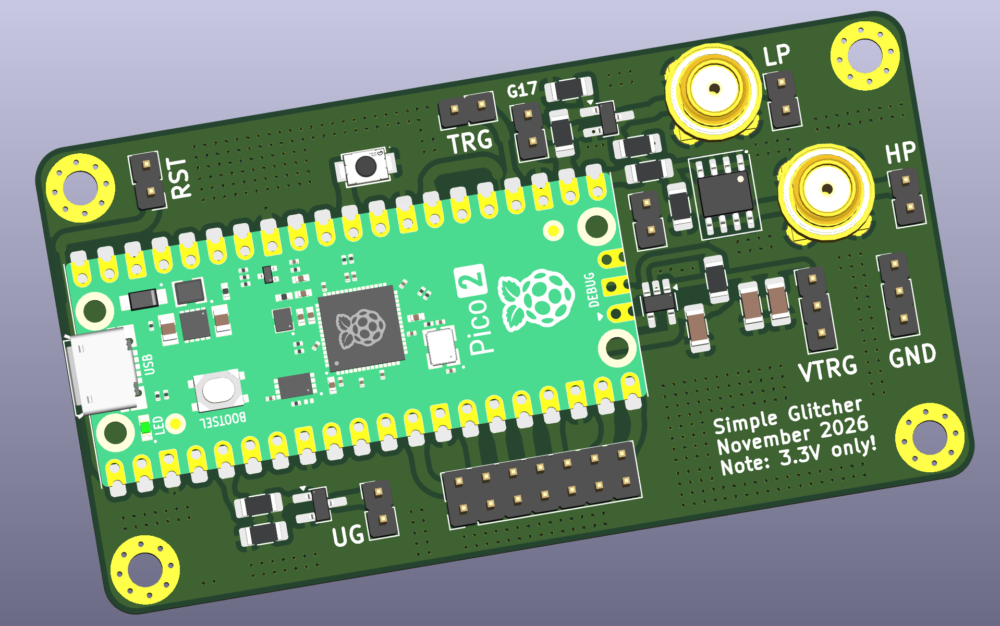

# Usage with examples

Findus (aka the fault-injection-library) is a toolchain to perform fault-injection attacks on microcontrollers and other targets.
This library offers an easy entry point to carry out fault-injection attacks against microcontrollers, SoCs and MCUs.
With the provided and easy to use functions and classes, fault-injection projects can be realized quickly with cheap and available hardware.

Findus supports the SimpleGlitcher, the [ChipWhisperer Pro](https://rtfm.newae.com/Capture/ChipWhisperer-Pro/), the [ChipWhisperer Husky](https://rtfm.newae.com/Capture/ChipWhisperer-Husky/) and the [Pico Glitcher](https://mkesenheimer.github.io/blog/pico-glitcher-v3.html).



More information about the fault-injection-library and the Pico Glitcher can be found on [https://fault-injection-library.readthedocs.io/en/latest/](https://fault-injection-library.readthedocs.io/en/latest/).

## Table of contents

- [Purchasing the Pico Glitcher](#purchasing-the-pico-glitcher)
- [Documentation](#documentation)
- [Installing findus](#installing-findus)
- [Updating the glitcher firmware](#updating-the-glitcher-firmware)
    - [Step 1: MicroPython firmware](#step-1-microPython-firmware)
    - [Step 2: Install the findus library](#step-2-install-the-findus-library)
    - [Step 3: Update the glitcher firmware](#step-3-update-the-glitcher-firmware)
- [Installing from source](#installing-from-source)
- [Test the functionality of your Pico Glitcher](#test-the-functionality-of-your-pico-glitcher)
- [UART Trigger](#uart-trigger)
- [More Examples](#more-examples)
- [Analyzer](#analyzer)

## Purchasing the Pico Glitcher

Only a Raspberry Pi Pico and a few other components are required to use this software.
However, in order to achieve the best results, a circuit board was developed that was adapted directly for the fault-injection-library.

The board consists of a Raspberry Pi Pico, two level shifters for in- and outputs with any voltage, and glitching transistors that can switch up to 66 amps.
A multiplexing stage to quickly switch between up to four different voltage levels was added in revision 2.

There are several connection options for different voltage sources, from 1.8V, 3.3V to 5V.
The Pico Glitcher can also be supplied with any external voltage via `VCC_EXTERN`.
To power the target board, it is supplied with power via the `VTARGET` connection.
The output of this voltage source can be controlled via software, i.e. the target can be completely disconnected from power by executing the `power_cycle_target()` command.
This allows a cold start of the target to be carried out in the event of error states that cannot be eliminated by a reset.


The Pico Glitcher can be purchased from the [faultyhardware](https://faultyhardware.de) online store. If you have questions or special requests, please feel free to contact me.


## Documentation

The documentation of the source code and how to use the library and the hardware can be found on [https://fault-injection-library.readthedocs.io/](https://fault-injection-library.readthedocs.io/).


## Installing findus

If you just want to get started quickly and don't want to bother with the source code of findus, findus can be installed via pip. The findus library can be found on [https://pypi.org/project/findus/](https://pypi.org/project/findus/) and can be installed locally in a Python environment using the following command:

```bash
mkdir my-fi-project && cd my-fi-project
python -m venv .venv
source .venv/bin/activate
pip install findus
```

Install the optional RD6006 python bindings if you have a RK6006 or a RD6006 power supply from Riden:

```bash
pip install rd6006
```

This external power supply can be used optionally to supply the target with power. It is possible to control the RD6006 power supply via the findus library using the power supply's USB interface. Suitable functions for this are implemented in the findus library.
Don't worry if you don't have this power supply. The Pico Glitcher can also supply the target with voltage.

Now you can use findus:

```bash
python
>>> from findus import Database, PicoGlitcher
...
```

The next step is to copy an existing glitching script and to adapt it to your needs.
Start by copying [https://github.com/MKesenheimer/fault-injection-library/blob/master/example/pico-glitcher.py](https://github.com/MKesenheimer/fault-injection-library/blob/master/example/pico-glitcher.py). More example projects are located at [https://github.com/MKesenheimer/fault-injection-library/tree/master/projects](https://github.com/MKesenheimer/fault-injection-library/tree/master/projects).

See [examples](examples.md) for more information how to use findus and the Pico Glitcher.

## Updating the glitcher firmware

Your glitcher should come with the latest firmware already installed. If not, follow the following procedure to update its software.

### Step 1: MicroPython firmware

Download the MicroPython firmware from [https://micropython.org/download/RPI_PICO/](https://micropython.org/download/RPI_PICO/). Unplug the Pico Glitcher from your computer, press and hold the 'BOOTSEL' button on the Raspberry Pi Pico and connect it back to your computer. The Raspberry Pi Pico should come up as a flash-storage device. Copy the MicroPython firmware ('RPI_PICO-xxxxxxxx-vx.xx.x.uf2') to this drive and wait until the Raspberry Pi Pico disconnects automatically.
More information about setting up the Raspberry Pi Pico can be found [here](https://projects.raspberrypi.org/en/projects/getting-started-with-the-pico).

### Step 2: Install the findus library

Skip this step, if you already installed findus previously.

If you want to make sure that the libraries to be installed do not collide with your local Python environment, use a virtual environment.
Set it up by generating a new virtual environment and by activating it:

```bash
python -m venv .venv
source .venv/bin/activate
```

After these steps we have to install findus (aka fault-injection-library).
Make sure to have pip [installed](https://docs.python.org/3/library/ensurepip.html).

```bash
pip install findus
```

### Step 3: Update the glitcher firmware

If everything went well, you should have the `update-fw` script available for execution in your command-line environment.
Connect the Pico Glitcher to your computer and check which serial device comes up:

```bash
ls /dev/tty*
```

Take note of the device path. Next update the Pico Glitcher firmware and the specific configuration for your Pico Glitcher hardware version via the following command:

```bash
update-fw --port /dev/<rpi-tty-port> --version <pico-glitcher-version>
```

For a SimpleGlitcher v0 connected as `/dev/ttyACM0`, use:

```bash
update-fw --port /dev/ttyACM0 --version v0
```

The `v0` selection uploads `config_v0/config.json`, which identifies the hardware as SimpleGlitcher v0 and applies its pinout. It defaults to the TPS2051B VTARGET power switch:

- [`TPS2051B`](https://www.ti.com/product/TPS2051B): active-high `EN`; this is the SimpleGlitcher v0 default.
- [`TPS2041B`](https://www.ti.com/product/TPS2041B): active-low `EN`; select it explicitly when this part is fitted.

To update a SimpleGlitcher v0 fitted with TPS2041B, use:

```bash
update-fw --port /dev/ttyACM0 --version v0 --vtarget-switch TPS2041B
```

Always select the part actually fitted to the board. Using the wrong selection reverses the VTARGET enable/disable behavior.

Your glitcher should now be ready to perform fault-injection attacks.

## Installing from source

If you want to get involved in the development or to have access to all the resources of this repository, clone the findus library:

```bash
git clone --depth 1 --recurse-submodules \ 
    https://github.com/MKesenheimer/fault-injection-library.git
```

Install the findus and the optional rd6006 library:

```bash
cd fault-injection-library
pip install .
cd rd6006
pip install .
update-fw --port /dev/<rpi-tty-port> --version <pico-glitcher-version>
```

The next step is to copy an existing glitching script and to adapt it to your needs.
Start by copying `fault-injection-library/example/pico-glitcher.py`. More example projects are located at `fault-injection-library/projects`.


## Test the functionality of your Pico Glitcher

The following  setup can be used to test the Pico Glitcher.

- Connect 'TRIGGER' input with 'RESET'.
- Between 'GLITCH' and 'VTARGET', connect a 10 Ohm resistor (this is the test target in this case).
- Optionally connect channel 1 of an oscilloscope to 'RESET' and channel 2 to 'GLITCH'.


Next, run the test script `pico-glitcher.py` located in `fault-injection-library/example`:

```bash
cd example
python pico-glitcher.py --rpico /dev/<rpi-tty-port> --delay 1000 1000 --length 100 100
```

For the SimpleGlitcher v0 test setup, use a 3.3 V `VTARGET`. The command requests a low-going glitch approximately `1 µs` after the rising edge on `RESET`, with a pulse width of approximately `100 ns`. Propagation delays and oscilloscope probe placement can cause small differences.

Useful starting settings for the oscilloscope are:

- Use 10× probes and DC coupling for both channels.
- Set channel 1 (`RESET`) and channel 2 (`GLITCH`) to approximately `1 V/div`.
- Trigger on the rising edge of channel 1 at approximately `1.5 V`.
- Start with a horizontal time base of `200 ns/div` and place the trigger near the left side of the display. This shows the RESET edge and the glitch in the same acquisition.
- After locating the pulse, use `20 ns/div` to `50 ns/div` to measure its approximately `100 ns` width more accurately.

The `GLITCH` trace should normally sit near `3.3 V` and briefly fall toward `0 V`. Keep both probe ground clips connected to the SimpleGlitcher ground.

Example session:

```
$ python pico-glitcher.py --rpico /dev/ttyACM0 --delay 1000 1000 --length 100 100
[+] Hardware: SimpleGlitcher v0.0.0
[+] Firmware version: [1, 14, 1]
[+] Version of findus: [1, 14, 1]
[+] Experiment 0	0	(NA)	100	1000	G	b'Trigger ok'
[+] Experiment 1	0	(NA)	100	1000	G	b'Trigger ok'
[+] Experiment 2	0	(NA)	100	1000	G	b'Trigger ok'
[+] Experiment 3	0	(NA)	100	1000	G	b'Trigger ok'
[+] Experiment 4	0	(NA)	100	1000	G	b'Trigger ok'
[+] Experiment 5	0	(NA)	100	1000	G	b'Trigger ok'
[+] Experiment 6	0	(NA)	100	1000	G	b'Trigger ok'
[+] Experiment 7	0	(NA)	100	1000	G	b'Trigger ok'
[+] Experiment 8	0	(NA)	100	1000	G	b'Trigger ok'
[+] Experiment 9	0	(NA)	100	1000	G	b'Trigger ok'
...
```

You should now be able to observe the glitches with an oscilloscope on the 10 Ohm resistor.
Measure the expected delay and glitch length with the oscilloscope.

## UART Trigger

- Connect 'TRIGGER' input to 'RX' and 'TX' of a USB-to-UART adapter
- Between 'GLITCH' and 'VTARGET', connect a 10 Ohm resistor (this is the test target in this case).
- Optionally connect channel 1 of an oscilloscope to 'RESET' and channel 2 to 'GLITCH'.


Next, run the test script `pico-glitcher-uart.py` located in `fault-injection-library/example`:

```bash
cd example
python pico-glitcher-uart.py --rpico /dev/<rpi-tty-port> --target /dev/<target-tty-port> --delay 1000 1000 --length 100 100
```

You should now be able to observe the glitches with an oscilloscope on the 10 Ohm resistor.
Measure the expected delay and glitch length with the oscilloscope.

## More Examples

More examples can be found on [https://fault-injection-library.readthedocs.io/en/latest/examples/#](https://fault-injection-library.readthedocs.io/en/latest/examples/#) or under `fault-injection-library/projects`.

## Analyzer

During your glitching campaign, run the `analyzer` script in a separate terminal window:

```bash
analyzer --directory databases
```

This spins up a local web application on [http://127.0.0.1:8080](http://127.0.0.1:8080) which can be used to observe the current progress.


