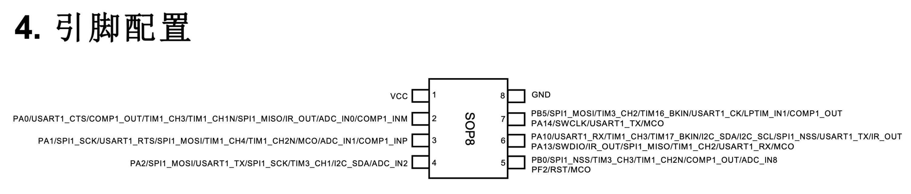

# PY32F003 glitch target

[`demo_py32f003.c`](demo_py32f003.c) is a deliberately vulnerable
voltage-glitch target for the Puya `PY32F003L16S6TU`. This part uses the SOP-8
L1 pinout and is built as the SDK's `PY32F003x6` target (32 KB flash and 4 KB
SRAM).

## SOP-8 pinout

The diagram and table are top views of the package. Pin 1 is beside the package
dot or notch; numbering proceeds counter-clockwise.



| Package pin | Default signal | Demo role | Connection |
| ---: | --- | --- | --- |
| 1 | `VCC` | Target supply and glitch node | `VTARGET`, `GLITCH`, and programmer target-reference voltage |
| 2 | `PA0` | Trigger output | Pico Glitcher `TRIGGER` input; optionally oscilloscope channel 1 |
| 3 | `PA1` | Success output | Logic analyzer or oscilloscope; goes high for 20 ms after a successful branch skip |
| 4 | `PA2` | Normal-failure output | Logic analyzer or oscilloscope; normally goes high for 20 ms |
| 5 | `PF2/NRST` | Reset | Programmer `NRST`; leave configured as reset |
| 6 | `PA13/SWDIO` | Serial-wire data | Programmer `SWDIO` |
| 7 | `PA14/SWCLK` | Serial-wire clock | Programmer `SWCLK` |
| 8 | `VSS` | Ground | Pico Glitcher, programmer, and instrument ground |

Pins 5, 6, and 7 have alternative GPIO/peripheral functions, but the demo does
not remap them. This preserves reset and SWD programming access.

## Pico Glitcher wiring

For crowbar voltage glitching, make these connections:

| Pico Glitcher | PY32F003L16S6TU |
| --- | --- |
| `VTARGET` | Pin 1 (`VCC`), preferably through a small series resistor |
| `GLITCH` | Pin 1 (`VCC`), on the target side of that series resistor |
| `TRIGGER` | Pin 2 (`PA0`) |
| `GND` | Pin 8 (`VSS`) |

The glitcher and target must share ground. Start with a current-limited 3.3 V
target supply. Do not drive pins 2, 3, or 4 from another push-pull output: all
three are outputs while this firmware runs.

The firmware drives `PA0` high immediately before loading the two comparison
operands and entering the vulnerable function. A fixed 128-instruction NOP sled
at the configured 24 MHz system clock provides about 5.33 us between that edge
and the operand loads. Normal execution then produces a pulse on `PA2`; a
skipped conditional branch produces a pulse on `PA1`.

The vulnerable function isolates the conditional `BNE` from adjacent useful
instructions. Its aligned halfword layout is `NOP|CMP`, eight `NOP|NOP` guard
words, `BNE|NOP`, eight more `NOP|NOP` guard words, then `MOVS|BX`. The default
16-NOP guard on each side provides about 667 ns of sacrificial instructions at
24 MHz. A short disturbance can therefore corrupt the branch and nearby NOPs
without also corrupting the comparison or success path. The guard count can be
changed with `DEMO_BRANCH_GUARD_NOPS`, but it must be even.

The [matching Zmu execution report](https://raw.githubusercontent.com/kholia/zmu/refs/heads/PY32F003-Support/report.txt)
reaches the `BNE` at `0x0800018c` exactly 160 target cycles after the `PA0`
rising edge. At 24 MHz this is 6666.7 ns. Normal execution clears `PA0` seven
cycles later, so its normal high pulse is 167 cycles, or about 6.958 us.
Measuring that pulse on the target is a useful check that the silicon clock and
the emulator timing agree before sweeping.

The two result pins form a marker protocol:

| `PA1` | `PA2` | Meaning |
| ---: | ---: | --- |
| 1 | 0 | Vulnerable check returned success |
| 0 | 1 | Vulnerable check returned failure |
| 1 | 1 | Boot or reboot marker (20 ms) |

The boot marker makes brown-out resets distinguishable from the failure pulse
that follows after execution resumes.

## SWD wiring

| Programmer | PY32F003L16S6TU |
| --- | --- |
| Target voltage/reference | Pin 1 (`VCC`) |
| `NRST` | Pin 5 (`PF2/NRST`) |
| `SWDIO` | Pin 6 (`PA13/SWDIO`) |
| `SWCLK` | Pin 7 (`PA14/SWCLK`) |
| `GND` | Pin 8 (`VSS`) |

Disconnect or disable the crowbar glitch output while programming. The
programmer's target-reference connection senses the target voltage; it should
not be used as the target's primary power source unless the programmer is
specifically designed to supply it.

## Build

The makefile expects `py32f0-template` to be beside this repository:

```bash
cd examples
make -f demo_py32f003.mk
```

Set `PY32_SDK` explicitly if the SDK is elsewhere:

```bash
make -f demo_py32f003.mk PY32_SDK=/path/to/py32f0-template
```

Build artifacts, including the ELF, binary, Intel HEX, map, and disassembly
listing, are written to `examples/build/py32f003-demo/`.

For a positive-control image that always takes the success path, override the
supplied value at build time:

```bash
make -f demo_py32f003.mk clean
make -f demo_py32f003.mk DEMO_SUPPLIED_VALUE=0xA55A1234UL
```

The NOP count is also configurable with `DEMO_PRE_BRANCH_NOPS`; the default of
128 is calibrated for the firmware's 24 MHz clock.
